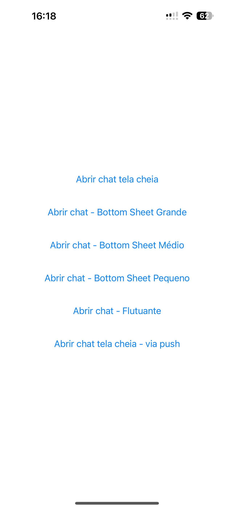
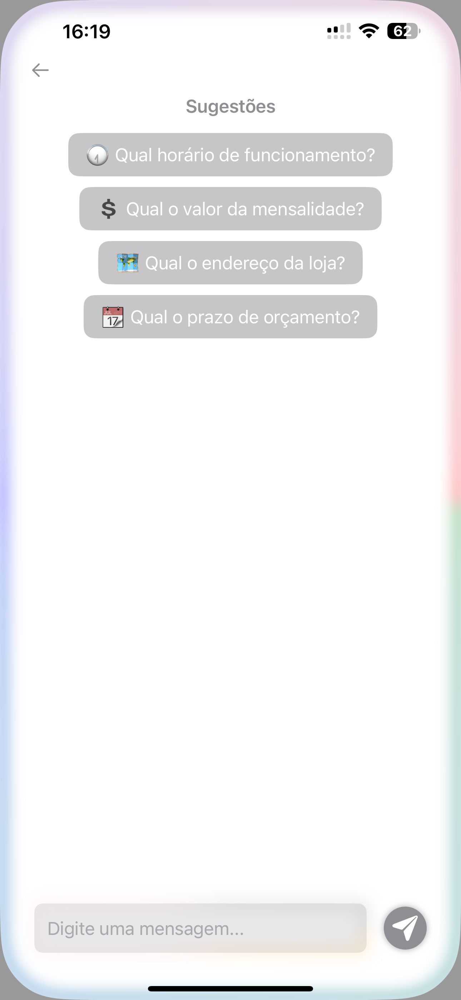
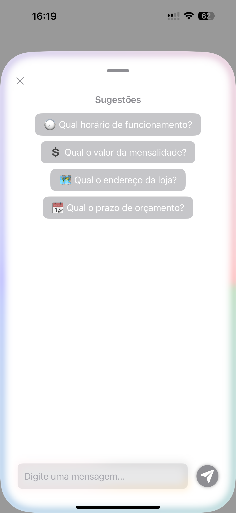
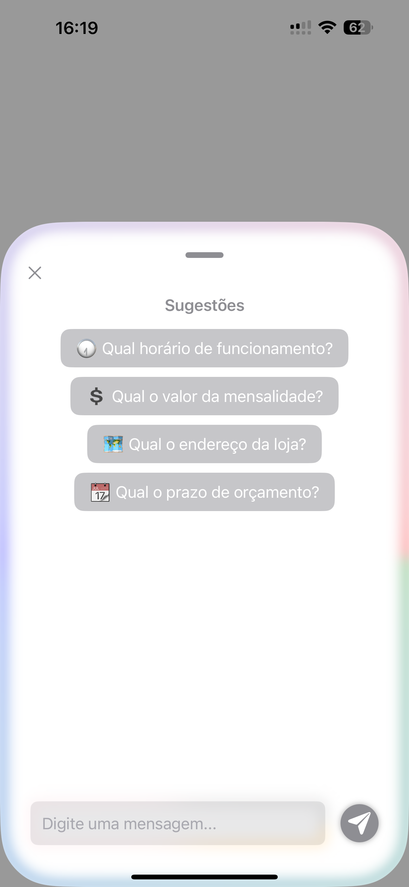
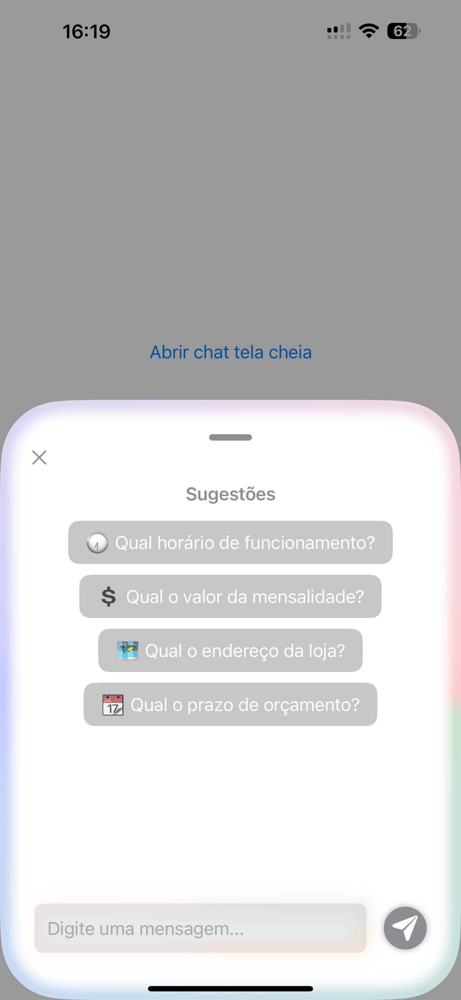
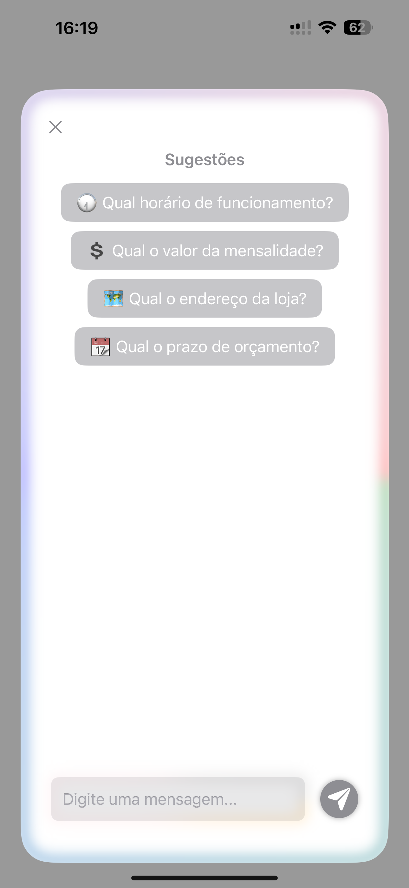
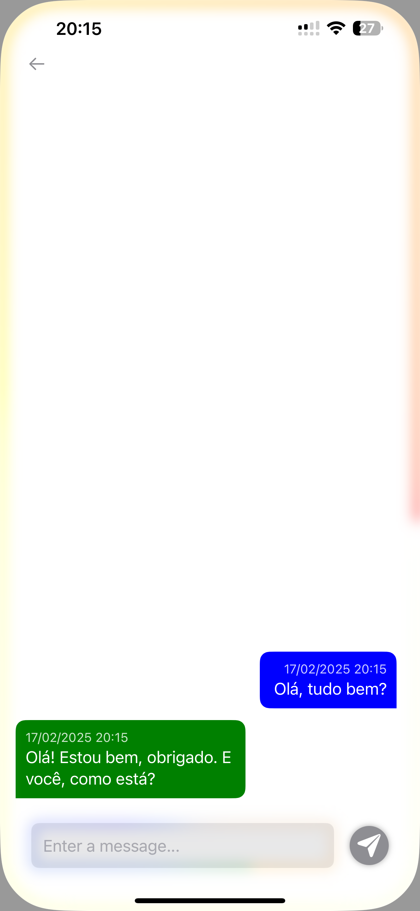

# 🗨️ **Megamil Chat** – Chat Inteligente para iOS  

O **Megamil Chat** é uma solução **open-source** para iOS (Swift 5, iOS 15+), que oferece uma interface de chat completa, moderna e altamente customizável.  

Seja para integrar assistentes virtuais, suporte ao cliente ou qualquer outra aplicação baseada em chat, este SDK fornece uma experiência fluida e personalizável com diversas opções de exibição e configuração.  

---

## 🚀 **Principais Recursos**  

✅ **Interface Completa** – Balões de conversa prontos, suporte a listas de sugestões, i18n e muito mais.  
🎨 **Totalmente Customizável** – Personalize cores, bordas, inputs, botões, fontes e layouts.  
📱 **Diferentes Modos de Exibição** – Use como **BottomSheet, tela cheia ou tela flutuante**.  
🔗 **Fácil Integração** – Comunicação via APIs externas ou diretamente com a OpenAI, Megamil Chat, ou a sua própria.  
🆓 **Modo ClipApp (sem programação)** – Para quem não quer codificar, basta gerar um JSON com os dados desejados e usá-lo diretamente no ClipApp, sem custos.  

---

## 📦 Instalação via CocoaPods

Para adicionar o **Megamil Chat** ao seu projeto, siga estes passos:

1. No seu `Podfile`, adicione a seguinte linha:

   ```ruby
   pod 'MegamilChat'
   ```

2. No terminal, execute o comando para instalar as dependências:

   ```sh
   pod install
   ```

Agora o **Megamil Chat** está pronto para ser usado no seu projeto! 🚀  

### 📂 Exemplos de Uso  

Abaixo, você encontrará mais exemplos de código. No entanto, se quiser testar diretamente, temos dois exemplos prontos na pasta `Samples` usando:  
- **Storyboard** 📌  
- **SwiftUI** 🍏  

Basta abrir um dos projetos e rodar para ver o SDK em ação!  

## 📸 Exemplos de Uso

<p align="center">
  <a href="Samples/prints/sample-1.PNG">
    
  </a>
  <a href="Samples/prints/sample-2.PNG">
    
  </a>
  <a href="Samples/prints/sample-3.PNG">
    
  </a>
  <a href="Samples/prints/sample-4.PNG">
    
  </a>
  <a href="Samples/prints/sample-5.PNG">
    
  </a>
  <a href="Samples/prints/sample-6.PNG">
    
  </a>
  <a href="Samples/prints/sample-7.PNG">
    
  </a>
</p>


## 🎯 **Como Usar o ClipApp Gratuitamente?**  

Caso não queira integrar o SDK ao seu app, você pode **usar o ClipApp sem programar e sem custos**.  

Basta preencher um JSON com as configurações desejadas, convertê-lo para Base64 e usá-lo em uma das URLs fornecidas. Isso permite o uso imediato do chatbot sem necessidade de desenvolvimento adicional.  

👉 Veja mais detalhes abaixo na documentação.  

# Requests de exemplo completa:
<!--Exemplo do json da request completo, os mesmos campos existem em swift, mas com o padrão `camelCase`-->
```json
 {
     "background_color": "#FFFFFF",
     "can_dragging": true,
     "show_border": true,
     "show_input_border": true,
     "show_return_button": false,
     "typing_effect": true,
     "them_name": "[Megamil Chat]",
     "presentation_style": "fullscreen",
     "type_endpoints": "MegamilChat",
     "messages": [
         {
             "text": "Olá, sou o Megamil Chat! como posso ajudar?",
             "timestamp": "05/11/2024 00:00",
             "is_from_me": false
         }
     ],
     "list_suggestions": "Sugestão 1...,Sugestão 2...",
     "placeholder": "Digite uma mensagem...",
     "send_button_icon": "paperplane.fill",
     "record_button_icon": "mic.fill",
     "button_color": "#0000FF",
     "list_border_colors": "008000FF,0000FFFF,FF0000FF",
     "list_input_border_colors": ["FFA500FF","FFC0CBFF","808080FF"],
     "ref": "",
     "name": "",
     "contact": "",
     "base_url": "",
     "endpoint": "",
     "bearer_token": "...",
     "allow_audio_recording": false,
     "me_bubble_color": "#0000FF",
     "me_bubble_text_color": "#FFFFFF",
     "them_bubble_color": "#008000",
     "them_bubble_text_color": "#FFFFFF"
 }
```

### Documentação dos campos:

- **`background_color`** *(string)* → Define a cor de fundo do chat em formato hexadecimal.  
- **`can_dragging`** *(boolean)* → Define se o usuário pode arrastar a janela do chat.  
- **`show_border`** *(boolean)* → Exibe uma borda ao redor do chat se `true`.  
- **`show_input_border`** *(boolean)* → Exibe uma borda ao redor da área de entrada de texto.  
- **`show_return_button`** *(boolean)* → Se `true`, exibe um botão de retorno na interface.  
- **`typing_effect`** *(boolean)* → Habilita efeito de digitação nas mensagens enviadas pelo bot.  
- **`them_name`** *(string)* → Nome do chatbot ou do agente da conversa.  
- **`presentation_style`** *(string)* → Define o estilo de apresentação do chat. Exemplo: `"fullscreen"` para tela cheia. `largebottomsheet`, `mediumbottomsheet` e `smallbottomsheet` para Bottom sheets em tamanhos diversos e por fim `floating` para aparecer fluturando 
- **`type_endpoints`** *(string)* → Tipo de endpoint que será utilizado na comunicação, Aceita três opções: OpenAI para conexão direta com a API da OpenAI, MegamilChat para usar nossa API e CustomURL para definir sua própria API personalizada, requerendo informar campos `base_url`, `endpoint` e `bearer_token`.   
- **`messages`** *(array de objetos)* → Lista de mensagens predefinidas no chat.  
  - **`text`** *(string)* → Conteúdo da mensagem.  
  - **`timestamp`** *(string)* → Data e hora no formato `"dd/MM/yyyy HH:mm"`.  
  - **`is_from_me`** *(boolean)* → Define se a mensagem é do usuário (`true`) ou do bot (`false`).  
- **`list_suggestions`** *(string)* → Sugestões de mensagens para o usuário, separadas por vírgulas ou um array de strings.  
- **`placeholder`** *(string)* → Texto de placeholder na área de entrada de mensagens.  
- **`send_button_icon`** *(string)* → Ícone do botão de envio (nome do ícone SF Symbols).  
- **`record_button_icon`** *(string)* → Ícone do botão de gravação de áudio (nome do ícone SF Symbols).  
- **`button_color`** *(string)* → Cor dos botões principais no formato hexadecimal.  
- **`list_border_colors`** *(string)* → Lista de cores adicionais para a borda, separadas por vírgula ou um array de strings.  
- **`list_input_border_colors`** *(string)* → Lista de cores adicionais para a borda do input de texto, separadas por vírgula ou um array de strings.  
- **`ref`** *(string)* → Referência opcional para identificar uma sessão de chat.  
- **`name`** *(string)* → Nome do usuário (caso necessário para personalização).  
- **`contact`** *(string)* → Informação de contato do usuário, se necessário.  
- **`base_url`** *(string)* → URL base da API que será usada para comunicação, obrigatório no caso de usar `type_endpoints:CustomURL`
- **`endpoint`** *(string)* → Endpoint específico para envio de mensagens, obrigatório no caso de usar `type_endpoints:CustomURL`  
- **`bearer_token`** *(string)* → Token de autenticação para requisições à API, OBRIGATÓRIO!  
- **`allow_audio_recording`** *(boolean)* → Define se a gravação de áudio está permitida.  
- **`me_bubble_color`** *(string)* → Cor do balão de mensagens do usuário.  
- **`me_bubble_text_color`** *(string)* → Cor do texto dentro do balão de mensagens do usuário.  
- **`them_bubble_color`** *(string)* → Cor do balão de mensagens do chatbot.  
- **`them_bubble_text_color`** *(string)* → Cor do texto dentro do balão de mensagens do chatbot.  

Alguns atributos só funcionarão quando o chat for chamado dentro da sua aplicação. No `AppClips`, certas funcionalidades, especialmente as relacionadas à apresentação da tela e ao botão de voltar, podem não estar disponíveis.  

## Exemplos de uso mais básico no swift  

### 1. Criando uma configuração básica  
Se deseja utilizar os valores padrão para todos os campos, exceto o `bearerToken`, que é obrigatório para autenticação no **Megamil Chat**, use:  

```swift
let config = MegamilChatConfig(
    bearerToken: "..." // Token de autenticação obrigatório para requisições
)
```

### 2. Configurando para uso direto com a OpenAI  
Caso queira utilizar a OpenAI diretamente, basta alterar o `typeEndpoints` para `"OpenAI"` e fornecer um token válido:  

```swift
let config = MegamilChatConfig(
    typeEndpoints: "OpenAI",
    bearerToken: "sk-proj-GGk...SSj4YA" // Token de autenticação obrigatório para requisições
)
```

### 3. Configurando para uso customizado
Caso queira utilizar sua API customizada diretamente, basta alterar o `typeEndpoints` para `"CustomURL"` e fornecer os dados:  

```swift
let config = MegamilChatConfig(
    baseUrl: "https://SUA_URL/",
    typeEndpoints: "CustomURL",
    endpoint: "SEU_ENDPOINT",
    bearerToken: "SEU_BEARER_TOKEN"
)
```

### 4. Criando a configuração a partir de um JSON  
Se estiver recebendo a configuração de uma API como um JSON em formato de string, o parse pode ser feito da seguinte forma:  

```swift
let jsonData = dataRaw.data(using: .utf8)!
let jsonDecoder = JSONDecoder()
let config = try! jsonDecoder.decode(MegamilChatConfig.self, from: jsonData)
```

# Quero usar com minha própria API

## 🔄 **O Que o Backend Deve Esperar Como Requisição?**  

O **Megamil Chat** envia os seguintes dados no **corpo (body) da requisição** ao backend configurado:  

```json
{
    "ref": "12345",       // (Opcional) Identificador único do usuário
    "name": "João Silva", // (Opcional) Nome do usuário
    "contact": "joao@email.com", // (Opcional) Contato do usuário (e-mail, telefone, etc.)
    "question": "Qual o horário de funcionamento?" // (Obrigatório) Pergunta enviada pelo usuário
}
```  

### 📌 **Detalhes dos Campos**  

- **`question`** (Obrigatório) → Contém a mensagem enviada pelo usuário e deve ser processada pelo backend para gerar uma resposta.  
- **`ref`** (Opcional) → Pode ser utilizado para identificar o usuário na base de dados do backend, como um ID interno da aplicação.  
- **`name` e `contact`** (Opcionais) → Caso a aplicação que usa o SDK solicite esses dados, eles serão repassados ao backend para facilitar a identificação do usuário.  

---

## 🏷️ **Informação Adicional no Header**  

Além do body, o SDK também envia no **header da requisição** a seguinte chave:  

```http
instant: MegamilChat
```  

Esse valor pode ser utilizado pelo backend para identificar que a requisição veio do **Megamil Chat** e aplicar qualquer lógica específica com base nessa informação.

## 📌 Formato esperado da resposta da API  

A API retorna um objeto JSON contendo as informações da resposta do chatbot. Abaixo está o formato esperado:  

```json
{
    "status": true,
    "message": "Essa é a resposta da IA.",
    "msg": "Mensagem da api",
    "data": {
        "answer": "Essa é a resposta da IA, em outro local",
        "audio_response": "base64 do audio",
        "question": "Pergunta do usuário"
    }
}
```

### 📝 Detalhes dos Campos  

| Campo            | Tipo     | Obrigatório | Descrição |
|-----------------|---------|------------|-----------|
| `status`        | `Bool`  | ✅ Sim      | Indica se a requisição foi processada corretamente. |
| `message`       | `String` | ⚠️ Não (se `answer` estiver presente) | Resposta da IA retornada diretamente no nível superior do JSON. |
| `msg`           | `String` | ❌ Não      | Mensagem adicional da API (pode ser um log ou erro). |
| `data.answer`   | `String` | ⚠️ Não (se `message` estiver presente) | Resposta da IA dentro do objeto `data`. |
| `data.audio_response` | `String` | ❌ Não | Resposta em áudio da IA, codificada em Base64. |
| `data.question` | `String` | ❌ Não | Pergunta original enviada pelo usuário. |

## 🔄 Regras de preenchimento  
- O campo `message` **não é obrigatório** se `answer` estiver presente, e vice-versa.  
- Se `data.answer` existir, ele será priorizado sobre `message`.  
- `msg` pode conter uma mensagem informativa da API, como logs ou detalhes adicionais.  
- `audio_response` pode ser usado para fornecer uma resposta em áudio codificada em Base64.  
- `question` pode ser preenchido com a pergunta original enviada pelo usuário.  

Esse formato garante flexibilidade ao lidar com diferentes tipos de resposta da IA.

# 📌 Como usar no ClipApps da LLMCHAT gratuitamente  
Para utilizar no ClipApps, o JSON deve ser convertido para **Base64** e passado como parâmetro na URL usando a query `config`:  

```
https://appclip.apple.com/id?p=br.com.megamil.LLMChat.Clip&config=
```

Alternativamente, você pode utilizar nosso endpoint, que no futuro também permitirá o redirecionamento para Android quando disponível:  

```
https://llmchat.megamil.com.br/chatbot/app?config=
```

Ao compartilhar o link, QR Code ou NFC, o ClipApp deve abrir automaticamente. No entanto, há uma limitação: quanto mais campos forem incluídos no JSON e convertidos para **Base64**, maior será o tamanho do hash final.  

Isso pode gerar alguns desafios, como:  
- **Tags NFC:** Podem precisar de maior capacidade de armazenamento.  
- **QR Codes:** Um código muito grande pode se tornar complexo e difícil de escanear.  

Por isso, recomenda-se evitar o uso excessivo de campos, especialmente um grande número de sugestões ou um histórico extenso de conversas, para garantir um carregamento rápido e eficiente.

# SwiftGen
Adicionar strings na pt-BR e en, depois executar:
```bash
swiftgen
```

# TODOs
* Permitir escolha de modelo ao chamar API da OpenAI
* Aceitar envio e recebimento de Audios, já está preparado na request, mas ainda não foi implementado.

---

O **Megamil Chat** facilita a implementação de experiências de chat avançadas no seu app, proporcionando flexibilidade e personalização para diferentes necessidades.
